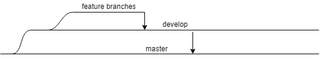

# Contributing to Flexor
Flexor welcomes contributions and suggestions.

## Branch Structure

## Pull Requests

When submitting a pull request:
* Cut a branch off of `develop` and give the branch a meaningful name starting with `feature/`.
* Ensure that there is an issue open to facilitate discussion about your work.
* Once all work is done submit a pull request from your feature branch back to `develop`.

