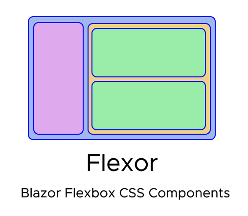

# Flexor

    

## Status
  

## Introduction
Flexor is a collection of Blazor components and configurations which allow developers to take full advantage of Flexbox CSS.  Flexor is highly configurable, allowing developers to create fully responsive and reactive Blazor web applications.

### Nuget
https://www.nuget.org/packages/Flexor/

## Documentation
The Flexor documentation main page is [here](https://derekchasse.github.io/Flexor/index.html).

## Examples and Demos
See the [Flexor.Demo](https://github.com/DerekChasse/Flexor/tree/master/Tests/Flexor.Demo) project for example pages of Flexor in action.

See Flexor in action live at the [demo site](http://flexor.azurewebsites.net).

## Contributing
See [CONTRIBUTING](CONTRIBUTING.md).

## Acknowledgements

Blazorise was a huge inspiration for the fluent style configuration used within Flexor.
___  
# [**Angular Flex Layout**](https://github.com/angular/flex-layout)

Angular Flex Layout was the driving inspiration for this entire project.
___
 

The CodingBlocks community has been a great source of feedback and discussion in the design and implementation of Flexor.
  